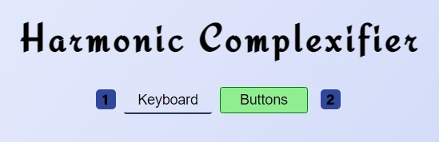
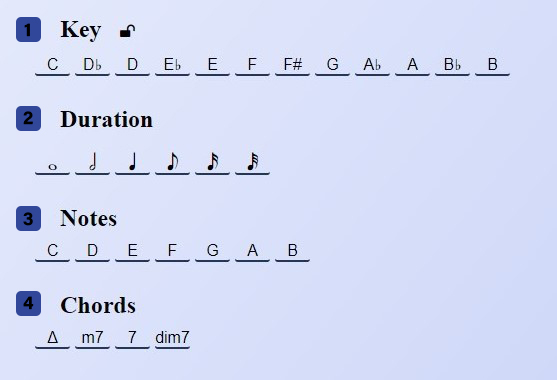
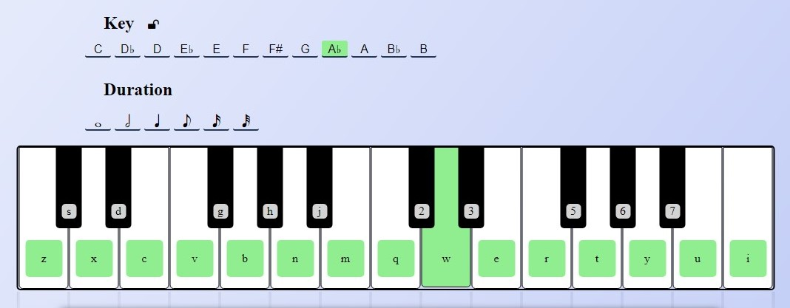
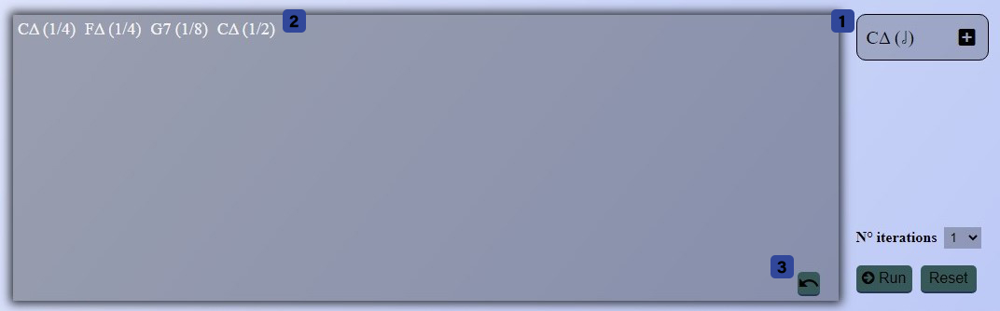

# Harmonic-Complexifier
## A web solution for your music progression

## Introduction
As a combined project for Advanced Coding Tools and Methodologies and Computer Music Representations and Models we developed a JavaScript-based program
that allows to make your chord progression more elaborated.

## User Interface
The interface is very simple and intuitive, with many buttons that allows you to insert a new chord in the progression.
In the following paragraph we'll see each section of the page in detail.

### Input Selection

In the top part of the page you can select the method of input for the chords.

1. **Keyboard:** allows you to insert a new chord with the keyboard on the screen
2. **Buttons:** set as default, allows you to insert a new chord just by clicking on buttons

### Caption

In this section we gather the nomenclature used inside the page.

### Buttons

If "Buttons" method is selected, you can build a new chord just by clicking on one button of each row:

1. **Key:** select the key of the progression
2. **Duration:** select the duration of the chord, shown as a note
3. **Note:** select the note; all the notes are generated on the circle of fifth, based on the selected key
4. **Chord:** select the type of chord to add

### Keyboard

If "Keyboard" method is selected, you can see a keyboard appears and allows you to insert new chords with two different input:
you can simply click on all the notes that compose the chord you want or you can also press the corresponding keys on your pc keyboard

### Input Progression

Everytime you click on a button or a new chord is detected by the keyboard, in this section a preview of the chord is updated (1).

That allows you to check the chord before adding it to the progression (2).

You can add the chord in the progression from the preview by clicking on the + button inside the preview section or with the enter key on your keyboard.

If you want to remove the last chord from the progression you can do that with a click on the undo button (3) or pressing the backspace key on your keyboard.

### Error

If you miss some input, that could it be some buttons or a key, and you try to add the new chord in the progression an error will appear

### Functional Buttons

In this section we select the number of iteration that we want to apply and when we click on "Run" a pop-up with the result will appear 

### Result

1. **Save:** you can export the result and download it in a text file
2. **Close:** you close the result panel and return to the main page

## Plugin
We used [Vue.js](https://vuejs.org/) to manage all the input and create an object-oriented javascript code that allows us to iterate the progression and detect each time the position of the chord we want to substitute

## Music Theory
All the theory on which we based all the substitution are explained in this [presentation](https://docs.google.com/presentation/d/15w7wlq7AzPL9jqlAuF4tYUQst4Wqg-f0GrSrpnlZ3ks/edit?usp=sharing)